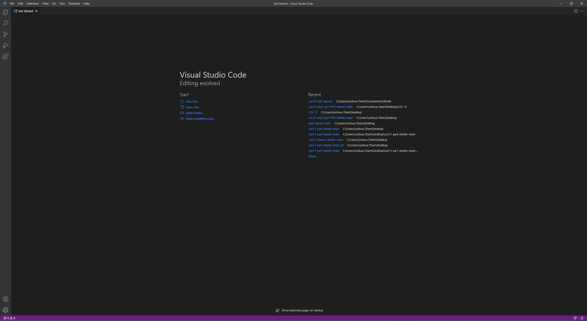

# Week 2 Lab Report
## Remote Access
---

## Installing VSCode
* Visit [https://code.visualstudio.com/](https://code.visualstudio.com/) to install Visual Studio Code
* Follow the provided installation instructions to complete installation
* Once Visual Studio Code has finished installation you should be able to see a screen similar to this and have successfully installed VSCode
